# System Architecture Analysis

## Overview

- **Project**: /home/tom/github/oqlos/sumd
- **Primary Language**: python
- **Languages**: python: 58, shell: 6, perl: 4
- **Analysis Mode**: static
- **Total Functions**: 542
- **Total Classes**: 109
- **Modules**: 68
- **Entry Points**: 375

## Architecture by Module

### sumd.cli
- **Functions**: 47
- **File**: `cli.py`

### sumd.extractor
- **Functions**: 45
- **File**: `extractor.py`

### sumd.dsl.engine
- **Functions**: 38
- **Classes**: 2
- **File**: `engine.py`

### sumd.dsl.schema_commands
- **Functions**: 33
- **Classes**: 2
- **File**: `schema_commands.py`

### sumd.prolog_engine
- **Functions**: 32
- **Classes**: 6
- **File**: `prolog_engine.py`

### sumd_logic_validator.sumd_logic_validator.engine
- **Functions**: 32
- **Classes**: 6
- **File**: `engine.py`

### sumd.dsl.commands
- **Functions**: 30
- **Classes**: 2
- **File**: `commands.py`

### sumd.dsl.parser
- **Functions**: 29
- **Classes**: 6
- **File**: `parser.py`

### sumd.cqrs.aggregates
- **Functions**: 23
- **Classes**: 6
- **File**: `aggregates.py`

### sumd.dsl.nlp
- **Functions**: 21
- **Classes**: 3
- **File**: `nlp.py`

### sumd.mcp_server
- **Functions**: 18
- **File**: `mcp_server.py`

### sumd.cqrs.sumd_aggregate
- **Functions**: 18
- **Classes**: 3
- **File**: `sumd_aggregate.py`

### sumd.cqrs.queries
- **Functions**: 17
- **Classes**: 13
- **File**: `queries.py`

### sumd.validator
- **Functions**: 16
- **Classes**: 1
- **File**: `validator.py`

### sumd.pipeline
- **Functions**: 16
- **Classes**: 1
- **File**: `pipeline.py`

### sumd.dsl.shell
- **Functions**: 14
- **Classes**: 2
- **File**: `shell.py`

### sumd.parser
- **Functions**: 9
- **Classes**: 1
- **File**: `parser.py`

### sumd.sections.architecture
- **Functions**: 9
- **Classes**: 1
- **File**: `architecture.py`

### sumd.toon_parser
- **Functions**: 8
- **File**: `toon_parser.py`

### sumd.sections.interfaces
- **Functions**: 8
- **Classes**: 1
- **File**: `interfaces.py`

## Key Entry Points

Main execution flows into the system:

### sumd.dsl.parser.DSLParser._parse_primary
> Parse primary expression.
- **Calls**: self._match, self._match, self._match, self._match, self._check, self._match, self._match, self._match

### sumd.cli.scan
> Scan a workspace directory and generate SUMD.md for every project found.

Detects projects by the presence of a known marker file (pyproject.toml,
pac
- **Calls**: cli.command, click.argument, click.option, click.option, click.option, click.option, click.option, click.option

### sumd.cli.analyze
> Run analysis tools (code2llm, redup, vallm) on a project.

Installs tools to .sumd-tools/venv and generates analysis files in project/.

PROJECT: Path
- **Calls**: cli.command, click.argument, click.option, click.option, project.resolve, click.echo, click.echo, sumd.cli._setup_tools_venv

### sumd.cli.scaffold
> Generate testql scenario scaffolds from OpenAPI spec or SUMD.md.

Reads openapi.yaml (if present) and generates .testql.toon.yaml scenario files
for e
- **Calls**: cli.command, click.argument, click.option, click.option, click.option, project.resolve, None.resolve, out_dir.mkdir

### sumd.cli.nlp_command
> Process natural language text and convert to DSL commands.
- **Calls**: cli.command, click.argument, click.option, click.option, click.option, asyncio.run, run_nlp, click.Path

### sumd.pipeline.RenderPipeline._collect
> Extract all project data and build RenderContext.
- **Calls**: sumd.extractor.extract_pyproject, sumd.extractor.extract_taskfile, sumd.toon_parser.extract_testql_scenarios, sumd.extractor.extract_openapi, sumd.extractor.extract_doql, sumd.extractor.extract_pyqual, sumd.extractor.extract_python_modules, sumd.extractor.extract_readme_title

### sumd.cli.generate
> Generate a SUMD document from structured format.

FILE: Path to the structured format file (json/yaml/toml)
- **Calls**: cli.command, click.argument, click.option, click.option, file.read_text, lines.append, data.get, lines.append

### sumd.cli.cqrs_command
> Execute CQRS command on SUMD aggregate.

COMMAND_TYPE: Type of command to execute
AGGREGATE_ID: ID of the aggregate (usually file path)

Examples:
   
- **Calls**: cli.command, click.option, click.argument, click.argument, click.option, asyncio.run, run_command, click.Path

### sumd.sections.call_graph._render_call_graph
> Render call graph summary from calls.toon.yaml in project_analysis.
- **Calls**: next, sumd.sections.call_graph._parse_calls_toon, a, a, a, a, a, a

### sumd.sections.api_stubs._render_api_stubs
> Render OpenAPI endpoints as Python-like typed stubs for LLM orientation.
- **Calls**: openapi.get, openapi.get, a, a, openapi.get, openapi.get, a, by_tag.items

### sumd.dsl.parser.DSLParser._parse_statement
> Parse a statement.
- **Calls**: self._match, self._parse_pipeline, self._match, self._check, self._advance, self._check_next, self._check_next, self._check_next

### sumd.sections.swop._render_swop_section
> Render SWOP manifest section.
- **Calls**: swop.get, a, a, a, a, swop.get, sorted, sorted

### sumd.dsl.shell.DSLShell._handle_shell_command
> Handle shell commands (prefixed with !).
- **Calls**: command.strip, os.system, print, print, print, print, print, print

### sumd.cli.lint
> Validate SUMD.md files — check markdown structure and codeblock formats.

Validates:
  - Markdown structure (H1, required H2 sections, metadata fields
- **Calls**: cli.command, click.argument, click.option, click.option, click.option, sumd.cli._lint_collect_paths, sys.exit, click.echo

### sumd.cli.dsl
> SUMD DSL Shell - Domain Specific Language for SUMD operations.

Provides an interactive shell and scripting interface for SUMD operations
with CQRS ES
- **Calls**: cli.command, click.option, click.option, click.option, click.option, asyncio.run, DSLShell, run_dsl

### sumd.dsl.shell.main
> Main entry point for DSL shell.
- **Calls**: argparse.ArgumentParser, parser.add_argument, parser.add_argument, parser.add_argument, parser.add_argument, parser.parse_args, DSLShell, Path

### sumd.cqrs.commands.SumdCommandHandler.handle
> Handle SUMD commands.
- **Calls**: SumdCommandExecuted, events.append, SumdDocumentCreated, events.append, SumdDocumentUpdated, events.append, SumdSectionAdded, events.append

### sumd.cli.map_cmd
> Generate project/map.toon.yaml — static code map in toon format.

Analyses all source files in the project and produces a map.toon.yaml
with module in
- **Calls**: cli.command, click.argument, click.option, click.option, click.option, project.resolve, click.echo, sumd.extractor.generate_map_toon

### sumd.cqrs.queries.SumdQueryHandler._handle_search_documents
> Handle search documents query.
- **Calls**: query.parameters.get, Path, query.parameters.get, query.parameters.get, project_path.rglob, file_path.is_file, str, file_path.read_text

### sumd.dsl.engine.DSLEngine._execute_comparison
> Execute comparison expression.
- **Calls**: len, ValueError, self._execute_expression, self._execute_expression, str, str, bool, re.search

### sumd.dsl.shell.DSLShell.execute_script
> Execute a DSL script file.
- **Calls**: print, script_path.exists, ValueError, script_path.read_text, content.splitlines, enumerate, line.strip, print

### sumd_logic_validator.sumd_logic_validator.engine.PythonPrologDB.parse_and_load
> Parses a simple Prolog file into rules/facts.
- **Calls**: re.sub, re.sub, c.strip, re.split, c.strip, c.split, sumd.prolog_engine.to_term, self.add_rule

### sumd.prolog_engine.PythonPrologDB.parse_and_load
> Parses a simple Prolog file into rules/facts.
- **Calls**: re.sub, re.sub, c.strip, re.split, c.strip, c.split, sumd.prolog_engine.to_term, sumd.prolog_engine._split_body_terms

### sumd.cli.export
> Export a SUMD document to structured format.

FILE: Path to the SUMD markdown file
- **Calls**: cli.command, click.argument, click.option, click.option, sumd.parser.SUMDParser.parse_file, click.Path, click.Choice, click.Path

### sumd.sections.source_snippets._render_source_snippets
> Render top-N modules with function/class signatures for LLM orientation.
- **Calls**: a, a, a, a, a, a, a, a

### sumd_logic_validator.sumd_logic_validator.cli.shell
> Start interactive logic query shell.
- **Calls**: main.command, sumd_logic_validator.sumd_logic_validator.cli.get_engine, console.print, Panel, None.strip, engine.query, q.lower, console.print

### examples.llm.openai_example.main
- **Calls**: argparse.ArgumentParser, parser.add_argument, parser.add_argument, parser.add_argument, parser.parse_args, Path, print, print

### sumd.prolog_engine.PythonPrologEngine._resolve
- **Calls**: isinstance, list, isinstance, sumd.prolog_engine.resolve_val, sumd.prolog_engine.resolve_val, sumd.prolog_engine.rename_variables, sumd.prolog_engine.unify, self._resolve

### sumd.prolog_engine.HybridPrologEngine._query_subprocess
> Executes query by spawning a swipl process.
- **Calls**: list, subprocess.run, res.stdout.splitlines, set, subprocess.run, print_goals.append, str, line.strip

### sumd.dsl.shell.DSLShell.run
> Run the interactive shell.
- **Calls**: print, print, print, print, print, self._get_prompt, None.strip, line.startswith

## Process Flows

Key execution flows identified:

### Flow 1: _parse_primary
```
_parse_primary [sumd.dsl.parser.DSLParser]
```

### Flow 2: scan
```
scan [sumd.cli]
```

### Flow 3: analyze
```
analyze [sumd.cli]
```

### Flow 4: scaffold
```
scaffold [sumd.cli]
```

### Flow 5: nlp_command
```
nlp_command [sumd.cli]
```

### Flow 6: _collect
```
_collect [sumd.pipeline.RenderPipeline]
  └─ →> extract_pyproject
      └─> _read_toml
  └─ →> extract_taskfile
  └─ →> extract_testql_scenarios
```

### Flow 7: generate
```
generate [sumd.cli]
```

### Flow 8: cqrs_command
```
cqrs_command [sumd.cli]
```

### Flow 9: _render_call_graph
```
_render_call_graph [sumd.sections.call_graph]
  └─> _parse_calls_toon
      └─> _parse_calls_header
      └─> _parse_calls_hubs
          └─> _process_in_hubs_line
```

### Flow 10: _render_api_stubs
```
_render_api_stubs [sumd.sections.api_stubs]
```

## Key Classes

### sumd.dsl.engine.DSLEngine
> Engine for executing DSL expressions.
- **Methods**: 33
- **Key Methods**: sumd.dsl.engine.DSLEngine.__init__, sumd.dsl.engine.DSLEngine.execute, sumd.dsl.engine.DSLEngine.execute_text, sumd.dsl.engine.DSLEngine._is_natural_language, sumd.dsl.engine.DSLEngine.process_natural_language, sumd.dsl.engine.DSLEngine.get_suggestions, sumd.dsl.engine.DSLEngine._execute_expression, sumd.dsl.engine.DSLEngine._execute_assignment, sumd.dsl.engine.DSLEngine._execute_command, sumd.dsl.engine.DSLEngine._execute_function_call

### sumd.dsl.parser.DSLParser
> Parser for DSL expressions.
- **Methods**: 25
- **Key Methods**: sumd.dsl.parser.DSLParser.__init__, sumd.dsl.parser.DSLParser.parse, sumd.dsl.parser.DSLParser._parse_statement, sumd.dsl.parser.DSLParser._parse_pipeline, sumd.dsl.parser.DSLParser._parse_assignment, sumd.dsl.parser.DSLParser._parse_logical_or, sumd.dsl.parser.DSLParser._parse_logical_and, sumd.dsl.parser.DSLParser._parse_comparison, sumd.dsl.parser.DSLParser._parse_arithmetic, sumd.dsl.parser.DSLParser._parse_term

### sumd.dsl.schema_commands.SchemaBasedCommands
> Implementation of schema-based DSL commands.
- **Methods**: 25
- **Key Methods**: sumd.dsl.schema_commands.SchemaBasedCommands.__init__, sumd.dsl.schema_commands.SchemaBasedCommands.execute_command, sumd.dsl.schema_commands.SchemaBasedCommands._execute_sumd_command, sumd.dsl.schema_commands.SchemaBasedCommands._execute_file_command, sumd.dsl.schema_commands.SchemaBasedCommands._execute_search_command, sumd.dsl.schema_commands.SchemaBasedCommands._execute_utility_command, sumd.dsl.schema_commands.SchemaBasedCommands._execute_nlp_command, sumd.dsl.schema_commands.SchemaBasedCommands._execute_schema_command, sumd.dsl.schema_commands.SchemaBasedCommands._cmd_sumd_scan, sumd.dsl.schema_commands.SchemaBasedCommands._cmd_sumd_validate

### sumd.cqrs.sumd_aggregate.SumdAggregate
> SUMD document aggregate root.
- **Methods**: 17
- **Key Methods**: sumd.cqrs.sumd_aggregate.SumdAggregate.__init__, sumd.cqrs.sumd_aggregate.SumdAggregate.state, sumd.cqrs.sumd_aggregate.SumdAggregate._when, sumd.cqrs.sumd_aggregate.SumdAggregate._when_document_created, sumd.cqrs.sumd_aggregate.SumdAggregate._when_document_updated, sumd.cqrs.sumd_aggregate.SumdAggregate._when_section_added, sumd.cqrs.sumd_aggregate.SumdAggregate._when_section_removed, sumd.cqrs.sumd_aggregate.SumdAggregate._when_document_validated, sumd.cqrs.sumd_aggregate.SumdAggregate.create_document, sumd.cqrs.sumd_aggregate.SumdAggregate.update_document
- **Inherits**: AggregateRoot

### sumd.cqrs.queries.SumdQueryHandler
> Handler for SUMD queries.
- **Methods**: 12
- **Key Methods**: sumd.cqrs.queries.SumdQueryHandler.__init__, sumd.cqrs.queries.SumdQueryHandler.can_handle, sumd.cqrs.queries.SumdQueryHandler.handle, sumd.cqrs.queries.SumdQueryHandler._handle_get_sumd_document, sumd.cqrs.queries.SumdQueryHandler._handle_list_sumd_sections, sumd.cqrs.queries.SumdQueryHandler._handle_get_sumd_section, sumd.cqrs.queries.SumdQueryHandler._handle_get_project_info, sumd.cqrs.queries.SumdQueryHandler._handle_get_event_history, sumd.cqrs.queries.SumdQueryHandler._handle_get_all_events, sumd.cqrs.queries.SumdQueryHandler._handle_search_documents
- **Inherits**: QueryHandler

### sumd.cqrs.aggregates.AggregateRoot
> Base aggregate root for event sourcing.
- **Methods**: 11
- **Key Methods**: sumd.cqrs.aggregates.AggregateRoot.__init__, sumd.cqrs.aggregates.AggregateRoot.aggregate_id, sumd.cqrs.aggregates.AggregateRoot.version, sumd.cqrs.aggregates.AggregateRoot.uncommitted_events, sumd.cqrs.aggregates.AggregateRoot.set_event_store, sumd.cqrs.aggregates.AggregateRoot.apply_event, sumd.cqrs.aggregates.AggregateRoot.mark_events_as_committed, sumd.cqrs.aggregates.AggregateRoot.load_from_history, sumd.cqrs.aggregates.AggregateRoot._when, sumd.cqrs.aggregates.AggregateRoot.commit
- **Inherits**: ABC

### sumd.dsl.nlp.NLPProcessor
> Natural Language Processor for DSL commands.
- **Methods**: 11
- **Key Methods**: sumd.dsl.nlp.NLPProcessor.__init__, sumd.dsl.nlp.NLPProcessor._initialize_default_intents, sumd.dsl.nlp.NLPProcessor._initialize_default_entities, sumd.dsl.nlp.NLPProcessor.parse_natural_language, sumd.dsl.nlp.NLPProcessor._text_matches_intent, sumd.dsl.nlp.NLPProcessor._extract_entities, sumd.dsl.nlp.NLPProcessor._extract_entity_value, sumd.dsl.nlp.NLPProcessor._extract_command_fallback, sumd.dsl.nlp.NLPProcessor._extract_entities_fallback, sumd.dsl.nlp.NLPProcessor.generate_dsl_command

### sumd.dsl.shell.DSLShell
> Interactive shell for SUMD DSL.
- **Methods**: 10
- **Key Methods**: sumd.dsl.shell.DSLShell.__init__, sumd.dsl.shell.DSLShell._setup_readline, sumd.dsl.shell.DSLShell._completer, sumd.dsl.shell.DSLShell._register_commands, sumd.dsl.shell.DSLShell.run, sumd.dsl.shell.DSLShell._get_prompt, sumd.dsl.shell.DSLShell._handle_shell_command, sumd.dsl.shell.DSLShell._execute_line, sumd.dsl.shell.DSLShell.execute_script, sumd.dsl.shell.DSLShell.execute_command

### sumd.dsl.schema_commands.SchemaCommandRegistry
> Registry for schema-based DSL commands.
- **Methods**: 8
- **Key Methods**: sumd.dsl.schema_commands.SchemaCommandRegistry.__init__, sumd.dsl.schema_commands.SchemaCommandRegistry._register_commands, sumd.dsl.schema_commands.SchemaCommandRegistry.get_command, sumd.dsl.schema_commands.SchemaCommandRegistry.list_commands, sumd.dsl.schema_commands.SchemaCommandRegistry.validate_command_call, sumd.dsl.schema_commands.SchemaCommandRegistry._validate_parameter_type, sumd.dsl.schema_commands.SchemaCommandRegistry.process_natural_language, sumd.dsl.schema_commands.SchemaCommandRegistry.get_suggestions

### sumd.dsl.nlp.NLPIntegration
> NLP integration for DSL engine.
- **Methods**: 7
- **Key Methods**: sumd.dsl.nlp.NLPIntegration.__init__, sumd.dsl.nlp.NLPIntegration.process_natural_language, sumd.dsl.nlp.NLPIntegration.get_suggestions, sumd.dsl.nlp.NLPIntegration.add_custom_intent, sumd.dsl.nlp.NLPIntegration.add_custom_entity, sumd.dsl.nlp.NLPIntegration.get_available_intents, sumd.dsl.nlp.NLPIntegration.get_intent_examples

### sumd.parser.SUMDParser
> Parser for SUMD markdown documents.
- **Methods**: 6
- **Key Methods**: sumd.parser.SUMDParser.__init__, sumd.parser.SUMDParser.parse, sumd.parser.SUMDParser.parse_file, sumd.parser.SUMDParser._parse_header, sumd.parser.SUMDParser._parse_sections, sumd.parser.SUMDParser.validate

### sumd.prolog_engine.HybridPrologEngine
> Hybrid Logic Engine delegating queries based on backend availability.
- **Methods**: 6
- **Key Methods**: sumd.prolog_engine.HybridPrologEngine.__init__, sumd.prolog_engine.HybridPrologEngine.query, sumd.prolog_engine.HybridPrologEngine._query_pyswip, sumd.prolog_engine.HybridPrologEngine._query_subprocess, sumd.prolog_engine.HybridPrologEngine._query_python, sumd.prolog_engine.HybridPrologEngine._swipl_executable_exists

### sumd.pipeline.RenderPipeline
> Collect project data → build sections → render → inject TOC.

Usage:
    pipeline = RenderPipeline(p
- **Methods**: 6
- **Key Methods**: sumd.pipeline.RenderPipeline.__init__, sumd.pipeline.RenderPipeline._collect, sumd.pipeline.RenderPipeline._build_registered_sections, sumd.pipeline.RenderPipeline._render_legacy_sections, sumd.pipeline.RenderPipeline._assemble, sumd.pipeline.RenderPipeline.run

### sumd.cqrs.events.EventStore
> In-memory event store with optional file persistence.
- **Methods**: 6
- **Key Methods**: sumd.cqrs.events.EventStore.__init__, sumd.cqrs.events.EventStore.save_event, sumd.cqrs.events.EventStore.get_events, sumd.cqrs.events.EventStore.get_all_events, sumd.cqrs.events.EventStore._persist_event, sumd.cqrs.events.EventStore._load_events

### sumd.cqrs.aggregates.Entity
> Base entity for domain objects.
- **Methods**: 6
- **Key Methods**: sumd.cqrs.aggregates.Entity.__init__, sumd.cqrs.aggregates.Entity.id, sumd.cqrs.aggregates.Entity.domain_events, sumd.cqrs.aggregates.Entity.add_domain_event, sumd.cqrs.aggregates.Entity.clear_domain_events, sumd.cqrs.aggregates.Entity.get_state
- **Inherits**: ABC

### sumd.dsl.commands.DSLCommandRegistry
> Registry for DSL commands.
- **Methods**: 6
- **Key Methods**: sumd.dsl.commands.DSLCommandRegistry.__init__, sumd.dsl.commands.DSLCommandRegistry.register, sumd.dsl.commands.DSLCommandRegistry.get_command, sumd.dsl.commands.DSLCommandRegistry.list_commands, sumd.dsl.commands.DSLCommandRegistry.list_categories, sumd.dsl.commands.DSLCommandRegistry.get_help

### sumd_logic_validator.sumd_logic_validator.engine.HybridPrologEngine
> Hybrid Logic Engine delegating queries based on backend availability.
- **Methods**: 6
- **Key Methods**: sumd_logic_validator.sumd_logic_validator.engine.HybridPrologEngine.__init__, sumd_logic_validator.sumd_logic_validator.engine.HybridPrologEngine.query, sumd_logic_validator.sumd_logic_validator.engine.HybridPrologEngine._query_pyswip, sumd_logic_validator.sumd_logic_validator.engine.HybridPrologEngine._query_subprocess, sumd_logic_validator.sumd_logic_validator.engine.HybridPrologEngine._query_python, sumd_logic_validator.sumd_logic_validator.engine.HybridPrologEngine._swipl_executable_exists

### sumd.cqrs.aggregates.EventSourcedRepository
> Event-sourced repository implementation.
- **Methods**: 5
- **Key Methods**: sumd.cqrs.aggregates.EventSourcedRepository.__init__, sumd.cqrs.aggregates.EventSourcedRepository.get_by_id, sumd.cqrs.aggregates.EventSourcedRepository.save, sumd.cqrs.aggregates.EventSourcedRepository.delete, sumd.cqrs.aggregates.EventSourcedRepository.clear_cache
- **Inherits**: Repository

### sumd.dsl.engine.DSLContext
> Execution context for DSL expressions.
- **Methods**: 5
- **Key Methods**: sumd.dsl.engine.DSLContext.__init__, sumd.dsl.engine.DSLContext.set_variable, sumd.dsl.engine.DSLContext.get_variable, sumd.dsl.engine.DSLContext.register_function, sumd.dsl.engine.DSLContext.get_function

### sumd.prolog_engine.Variable
> Represents a logical variable in our pure Python engine.
- **Methods**: 4
- **Key Methods**: sumd.prolog_engine.Variable.__init__, sumd.prolog_engine.Variable.__repr__, sumd.prolog_engine.Variable.__eq__, sumd.prolog_engine.Variable.__hash__

## Data Transformation Functions

Key functions that process and transform data:

### sumd.toon_parser._parse_toon_block_config
> Extract CONFIG key-value pairs from toon file lines.
- **Output to**: re.match, re.match, line.startswith, re.match, m.group

### sumd.toon_parser._parse_toon_block_api
> Extract API endpoint rows from toon content.
- **Output to**: re.findall, None.strip, endpoints.append, int

### sumd.toon_parser._parse_toon_block_assert
> Extract ASSERT rows from toon file lines.
- **Output to**: re.match, re.match, line.startswith, re.match, rows.append

### sumd.toon_parser._parse_toon_block_performance
> Extract PERFORMANCE rows from toon file lines.
- **Output to**: re.match, re.match, line.startswith, re.match, rows.append

### sumd.toon_parser._parse_toon_block_navigate
> Extract NAVIGATE url rows from toon file lines.
- **Output to**: re.match, re.match, line.startswith, line.strip, urls.append

### sumd.toon_parser._parse_toon_block_gui
> Extract GUI action rows from toon file lines.
- **Output to**: re.match, re.match, line.startswith, re.match, actions.append

### sumd.toon_parser._parse_toon_file
> Parse a single *.testql.toon.yaml file into a scenario dict.
- **Output to**: f.read_text, content.splitlines, re.search, str, sumd.dsl.parser.DSLParser._match

### sumd.validator._validate_yaml_body
> Check YAML body is parseable.
- **Output to**: yaml.safe_load

### sumd.validator._validate_less_css_body
> Basic sanity: balanced braces.
- **Output to**: body.count, body.count

### sumd.validator._validate_mermaid_body
> Check mermaid block starts with a valid diagram type.
- **Output to**: None.strip, any, None.split, first.startswith, body.strip

### sumd.validator._validate_toon_body
> Check toon block has at least one recognised section header.
- **Output to**: re.findall

### sumd.validator._validate_bash_body
> Check bash block is non-empty and doesn't contain obvious placeholders.
- **Output to**: body.strip

### sumd.validator._validate_deps_body
> Each line of a deps block should be a valid pip requirement or empty.
- **Output to**: enumerate, body.splitlines, line.strip, line.startswith, re.match

### sumd.validator._validate_markpact_meta
> Check markpact annotation kind and required attributes.
- **Output to**: mp.group, _MARKPACT_REQUIRED_ATTRS.get, mp.group, issues.append, issues.append

### sumd.validator.validate_codeblocks
> Validate all fenced code blocks in *content*.

Checks:
- markpact annotation syntax (kind, required 
- **Output to**: _CODEBLOCK_RE.finditer, None.strip, None.strip, None.strip, _MARKPACT_META_RE.search

### sumd.validator.validate_markdown
> Validate SUMD markdown structure.

Checks:
- H1 title present
- Required H2 sections present (profil
- **Output to**: content.splitlines, sumd.validator._check_empty_links, sumd.validator._check_unclosed_fences, sumd.validator._check_metadata_fields, sumd.validator._check_h1

### sumd.validator.validate_project_architecture
> Run Prolog-based architectural consistency checks on the project.

Returns:
    list[str]: list of l
- **Output to**: sumd.extractor.generate_project_logic, rules_path.read_text, PythonPrologDB, db.parse_and_load, db.parse_and_load

### sumd.validator.validate_sumd_file
> Run all validators on a SUMD.md file.

Returns:
    {
      "source": str,
      "markdown": list[st
- **Output to**: path.read_text, sumd.validator.validate_markdown, sumd.validator.validate_codeblocks, None.parent.resolve, sumd.validator.validate_project_architecture

### sumd.parser.SUMDParser.parse
> Parse a SUMD markdown document.

Args:
    content: The markdown content to parse

Returns:
    SUMD
- **Output to**: SUMDDocument, content.split, self._parse_header, self._parse_sections

### sumd.parser.SUMDParser.parse_file
> Parse a SUMD file.

Args:
    path: Path to the SUMD markdown file

Returns:
    SUMDDocument: Parse
- **Output to**: path.read_text, self.parse

### sumd.parser.SUMDParser._parse_header
> Parse the project header (H1).

Args:
    lines: List of document lines
- **Output to**: enumerate, line.startswith, None.strip, header_content.split, None.strip

### sumd.parser.SUMDParser._parse_sections
> Parse all sections in the document.

Args:
    lines: List of document lines
- **Output to**: line.startswith, None.strip, sections.append, None.lower, self.SECTION_MAPPING.get

### sumd.parser.SUMDParser.validate
> Validate a SUMD document against the specification.

Args:
    document: The document to validate

R
- **Output to**: errors.append, errors.append, errors.append, errors.append

### sumd.parser.parse
> Parse a SUMD markdown document.

Args:
    content: The markdown content to parse

Returns:
    SUMD
- **Output to**: SUMDParser, parser.parse

### sumd.parser.parse_file
> Parse a SUMD file.

Args:
    path: Path to the SUMD markdown file

Returns:
    SUMDDocument: Parse
- **Output to**: SUMDParser, parser.parse_file

## Behavioral Patterns

### recursion_to_term
- **Type**: recursion
- **Confidence**: 0.90
- **Functions**: sumd.prolog_engine.to_term

### recursion_unify
- **Type**: recursion
- **Confidence**: 0.90
- **Functions**: sumd.prolog_engine.unify

### recursion_deep_resolve
- **Type**: recursion
- **Confidence**: 0.90
- **Functions**: sumd.prolog_engine.deep_resolve

### recursion_occurs_check
- **Type**: recursion
- **Confidence**: 0.90
- **Functions**: sumd.prolog_engine.occurs_check

### recursion__walk_projects
- **Type**: recursion
- **Confidence**: 0.90
- **Functions**: sumd.cli._walk_projects

### recursion_to_term
- **Type**: recursion
- **Confidence**: 0.90
- **Functions**: sumd_logic_validator.sumd_logic_validator.engine.to_term

### recursion_unify
- **Type**: recursion
- **Confidence**: 0.90
- **Functions**: sumd_logic_validator.sumd_logic_validator.engine.unify

### recursion_deep_resolve
- **Type**: recursion
- **Confidence**: 0.90
- **Functions**: sumd_logic_validator.sumd_logic_validator.engine.deep_resolve

### recursion_occurs_check
- **Type**: recursion
- **Confidence**: 0.90
- **Functions**: sumd_logic_validator.sumd_logic_validator.engine.occurs_check

### state_machine_SumdAggregate
- **Type**: state_machine
- **Confidence**: 0.70
- **Functions**: sumd.cqrs.sumd_aggregate.SumdAggregate.__init__, sumd.cqrs.sumd_aggregate.SumdAggregate.state, sumd.cqrs.sumd_aggregate.SumdAggregate._when, sumd.cqrs.sumd_aggregate.SumdAggregate._when_document_created, sumd.cqrs.sumd_aggregate.SumdAggregate._when_document_updated

## Public API Surface

Functions exposed as public API (no underscore prefix):

- `sumd.extractor.generate_project_logic` - 71 calls
- `examples.mcp.mcp_client.run` - 53 calls
- `sumd.dsl.commands.create_builtin_registry` - 45 calls
- `sumd.cli.scan` - 40 calls
- `sumd.cli.analyze` - 33 calls
- `sumd.cli.scaffold` - 33 calls
- `sumd.cli.nlp_command` - 33 calls
- `sumd.cli.generate` - 30 calls
- `sumd.prolog_engine.to_term` - 29 calls
- `sumd_logic_validator.sumd_logic_validator.engine.to_term` - 29 calls
- `sumd.cli.cqrs_command` - 28 calls
- `sumd.extractor.extract_goal` - 24 calls
- `sumd.extractor.generate_map_toon` - 24 calls
- `sumd.cli.lint` - 23 calls
- `sumd.extractor.extract_docker_compose` - 22 calls
- `sumd.cli.dsl` - 21 calls
- `sumd.dsl.shell.main` - 21 calls
- `sumd.cqrs.commands.SumdCommandHandler.handle` - 21 calls
- `sumd.cli.map_cmd` - 20 calls
- `sumd.validator.validate_codeblocks` - 17 calls
- `sumd.extractor.extract_pyproject` - 17 calls
- `sumd.dsl.shell.DSLShell.execute_script` - 17 calls
- `sumd_logic_validator.sumd_logic_validator.engine.PythonPrologDB.parse_and_load` - 17 calls
- `sumd.prolog_engine.PythonPrologDB.parse_and_load` - 16 calls
- `sumd.cli.export` - 16 calls
- `sumd_logic_validator.sumd_logic_validator.cli.shell` - 16 calls
- `examples.llm.openai_example.main` - 15 calls
- `sumd.validator.validate_project_architecture` - 15 calls
- `sumd.extractor.extract_package_json` - 15 calls
- `sumd.dsl.shell.DSLShell.run` - 15 calls
- `sumd.dsl.schema_commands.SchemaBasedCommands.execute_command` - 15 calls
- `examples.llm.anthropic_example.main` - 14 calls
- `sumd.mcp_server.list_tools` - 14 calls
- `sumd.sections.metadata.MetadataSection.render` - 14 calls
- `sumd_logic_validator.sumd_logic_validator.cli.query` - 14 calls
- `sumd.prolog_engine.unify` - 13 calls
- `sumd.cli.validate` - 13 calls
- `sumd.cli.extract` - 13 calls
- `sumd.extractor.extract_openapi` - 13 calls
- `sumd.extractor.extract_env` - 13 calls

## System Interactions

How components interact:

```mermaid
graph TD
    _parse_primary --> _match
    _parse_primary --> _check
    scan --> command
    scan --> argument
    scan --> option
    analyze --> command
    analyze --> argument
    analyze --> option
    analyze --> resolve
    scaffold --> command
    scaffold --> argument
    scaffold --> option
    nlp_command --> command
    nlp_command --> argument
    nlp_command --> option
    _collect --> extract_pyproject
    _collect --> extract_taskfile
    _collect --> extract_testql_scena
    _collect --> extract_openapi
    _collect --> extract_doql
    generate --> command
    generate --> argument
    generate --> option
    generate --> read_text
    cqrs_command --> command
    cqrs_command --> option
    cqrs_command --> argument
    _render_call_graph --> next
    _render_call_graph --> _parse_calls_toon
    _render_call_graph --> a
```



## Reverse Engineering Guidelines

1. **Entry Points**: Start analysis from the entry points listed above
2. **Core Logic**: Focus on classes with many methods
3. **Data Flow**: Follow data transformation functions
4. **Process Flows**: Use the flow diagrams for execution paths
5. **API Surface**: Public API functions reveal the interface

## Context for LLM

Maintain the identified architectural patterns and public API surface when suggesting changes.